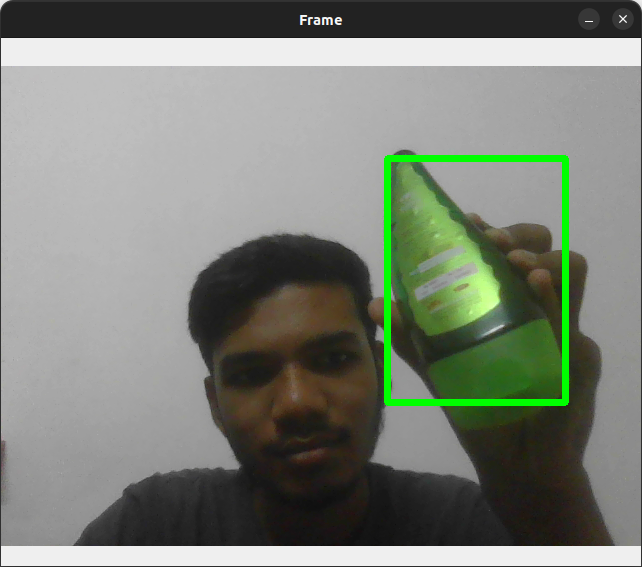

# Color Object Tracking with OpenCV

This project tracks objects of a specified color using OpenCV and displays the bounding box around the detected object in real-time using a webcam.

## Requirements

- Python 3.x
- OpenCV 4.6.0.66
- NumPy 1.23.4
- Pillow 9.2.0

You can install the required packages using:

```bash
pip install -r requirements.txt
```

## Usage

1. Clone the repository:

    ```bash
    git clone https://github.com/yourusername/color-object-tracking.git
    cd color-object-tracking
    ```

2. Run the main script:

    ```bash
    python main.py
    ```

3. Press `q` to exit the program.

## How It Works

- The script captures video input from the webcam.
- Converts the video frame from BGR to HSV color space.
- Creates a mask for the specified color.
- Finds the bounding box around the detected object of the specified color.
- Displays the original frame with the bounding box and the mask in separate windows.

## Customization

You can change the color to track by modifying the `color` variable in `main.py`. The color should be specified in BGR format.

## Output

<!-- ### Example Output -->



## Contributing

Contributions are welcome! Please create an issue or submit a pull request for any improvements or bug fixes.

### Notes

- Ensure the color you want to track is correctly defined in the BGR format.
- Ensure your webcam is connected and accessible.

This README file provides clear instructions and information about the project, making it easy for others to understand and use it.